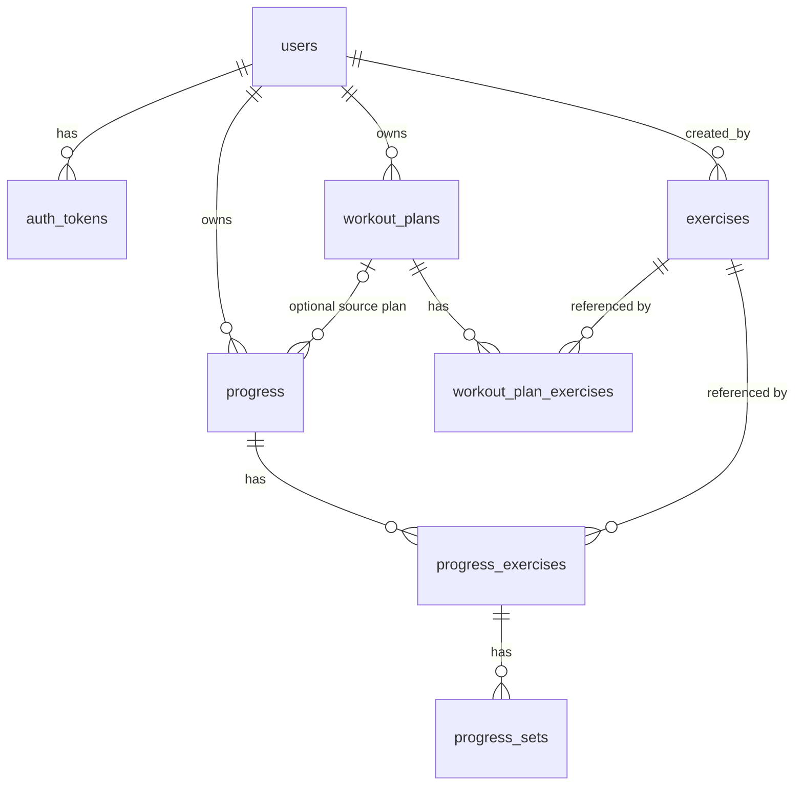

# Data Model

PostgreSQL. All tables in one place; details and rationale live in the endpoint specs (linked). This is the source for the first migrations.

## Conventions

- Primary keys: `uuid`. Client-generated for progress, plans and (optionally) exercises; server-generated (UUID v7) for users and tokens.
- Timestamps: `timestamptz`, always UTC.
- Enum-like columns: `text` + `CHECK` constraint matching [api/enums.md](api/enums.md). Easier to extend by migration than native Postgres enums.
- Weights in **kg**: `numeric(7,2)`. Distances in meters: `numeric(9,2)`. Durations in seconds: `integer`.
- Soft delete: `deleted_at timestamptz NULL`. Nothing is hard-deleted in v1.
- Sync columns on phone-written data: `client_updated_at` (API `updated_at`, drives the conflict rule) and `server_updated_at` (sync cursor). See [conventions](api/conventions.md#sync-semantics).
- Every query on user-owned data filters by `user_id`. Child tables are only reached through their parent.
- Extension needed: `pg_trgm` (exercise name search).

## Relationships

## users

Endpoints: [1](api/endpoints/01-register.md), [2](api/endpoints/02-login.md), [13](api/endpoints/13-admin-revoke-login.md), [14](api/endpoints/14-admin-change-password.md). Also created by the admin CLI.

| Column | Type | Constraints / notes |
|--------|------|---------------------|
| id | uuid | PK, server-generated v7 |
| username | text | NOT NULL, UNIQUE, stored lowercase, CHECK matches `^[a-z0-9_]{3,30}$` |
| password_hash | text | NOT NULL, argon2id encoded string |
| role | text | NOT NULL, default `user`, CHECK in (`user`, `admin`) |
| created_at | timestamptz | NOT NULL, default now() |
| updated_at | timestamptz | NOT NULL, default now(); bumped on password change |

## auth_tokens

Endpoints: [2](api/endpoints/02-login.md), [11](api/endpoints/11-logout.md), [12](api/endpoints/12-revoke.md), [13](api/endpoints/13-admin-revoke-login.md), [14](api/endpoints/14-admin-change-password.md), [15](api/endpoints/15-list-tokens.md), and the auth middleware on every request.

| Column | Type | Constraints / notes |
|--------|------|---------------------|
| id | uuid | PK, returned to the app as `token_id` (not secret) |
| user_id | uuid | NOT NULL, FK users |
| token_hash | bytea | NOT NULL, UNIQUE, SHA-256 of the raw token; raw token never stored |
| device_name | text | NULL, max 100 |
| created_at | timestamptz | NOT NULL, default now() |
| expires_at | timestamptz | NOT NULL, created_at + 365 days |
| last_used_at | timestamptz | NULL, updated at most once per hour |
| revoked_at | timestamptz | NULL |

Indexes: unique `(token_hash)`; `(user_id)`.
Purge: daily job deletes rows expired or revoked more than 30 days ago.

## exercises

Shared master catalog. Endpoints: [8](api/endpoints/08-get-list-exercise.md), [9](api/endpoints/09-create-exercise.md), [18](api/endpoints/18-update-exercise.md), [19](api/endpoints/19-delete-exercise.md), [20](api/endpoints/20-set-exercise-image.md), [21](api/endpoints/21-delete-exercise-image.md).

| Column | Type | Constraints / notes |
|--------|------|---------------------|
| id | uuid | PK; client-generated if supplied, else server |
| name | text | NOT NULL, trimmed, length 1–100 |
| category | text | NOT NULL, CHECK in enum list |
| primary_muscle_group | text | NOT NULL, CHECK in enum list |
| secondary_muscle_groups | text[] | NOT NULL, default empty; each value in enum list, max 5, no duplicates, not the primary (checked in app) |
| equipment | text | NOT NULL, CHECK in enum list |
| measurement_type | text | NOT NULL, CHECK in enum list |
| instructions | text | NULL, max 4000 |
| image_hash | text | NULL, 16 hex chars |
| image_ext | text | NULL, CHECK in (`jpg`, `png`, `webp`) |
| image_size_bytes | integer | NULL |
| created_by | uuid | NOT NULL, FK users |
| created_at | timestamptz | NOT NULL, default now() |
| updated_at | timestamptz | NOT NULL, default now(); server-set on every edit, image change, delete |
| deleted_at | timestamptz | NULL |

Constraints: `image_hash`, `image_ext`, `image_size_bytes` are all NULL or all NOT NULL.
Indexes:
- **unique** `(lower(name))` **where `deleted_at IS NULL`** (name reusable after delete)
- `(updated_at, id)` for sync
- `(primary_muscle_group)` for filtering
- GIN trigram on `lower(name)` for `q` search

`image_url` is not stored; built from `MEDIA_BASE_URL` + id + hash + ext.

## workout_plans

Endpoints: [6](api/endpoints/06-get-list-workout-plan.md), [7](api/endpoints/07-get-workout-plan.md), [10](api/endpoints/10-save-workout-plan.md), [17](api/endpoints/17-delete-workout-plan.md).

| Column | Type | Constraints / notes |
|--------|------|---------------------|
| id | uuid | PK, client-generated |
| user_id | uuid | NOT NULL, FK users |
| name | text | NOT NULL, length 1–100 (duplicates allowed) |
| description | text | NULL, max 1000 |
| client_updated_at | timestamptz | NOT NULL; API field `updated_at` |
| created_at | timestamptz | NOT NULL, default now() |
| server_updated_at | timestamptz | NOT NULL; set on accepted write and delete |
| deleted_at | timestamptz | NULL |

Indexes: `(user_id, server_updated_at, id)` for sync; `(user_id, lower(name), id)` for default listing.
Rule (app-level): max 100 non-deleted plans per user.

## workout_plan_exercises

| Column | Type | Constraints / notes |
|--------|------|---------------------|
| id | uuid | PK, server-generated |
| workout_plan_id | uuid | NOT NULL, FK workout_plans, ON DELETE CASCADE |
| exercise_id | uuid | NOT NULL, FK exercises (soft-deleted exercises still valid) |
| position | integer | NOT NULL, ≥ 0 |
| target_sets | integer | NOT NULL, CHECK 1–20 |
| target_reps | integer | NULL, CHECK ≥ 1 |
| target_reps_max | integer | NULL, CHECK ≥ target_reps, requires target_reps |
| target_weight | numeric(7,2) | NULL, CHECK ≥ 0 (kg) |
| target_duration_seconds | integer | NULL, CHECK ≥ 0 |
| target_distance_meters | numeric(9,2) | NULL, CHECK ≥ 0 |
| rest_seconds | integer | NULL, CHECK 0–3600 |
| notes | text | NULL, max 1000 |

Unique `(workout_plan_id, position)`. Index `(exercise_id)`.
Rows are deleted and re-inserted on every accepted save, in the same transaction.

## progress

One completed workout session. Endpoints: [3](api/endpoints/03-save-progress.md), [4](api/endpoints/04-get-progress.md), [5](api/endpoints/05-get-list-progress.md), [16](api/endpoints/16-delete-progress.md).

| Column | Type | Constraints / notes |
|--------|------|---------------------|
| id | uuid | PK, client-generated |
| user_id | uuid | NOT NULL, FK users |
| workout_plan_id | uuid | NULL, FK workout_plans (soft-deleted plans still valid) |
| name | text | NOT NULL, length 1–100 |
| notes | text | NULL, max 2000 |
| started_at | timestamptz | NOT NULL |
| ended_at | timestamptz | NOT NULL, CHECK ≥ started_at |
| duration_seconds | integer | NOT NULL, CHECK 0–86400 |
| client_updated_at | timestamptz | NOT NULL; API field `updated_at` |
| created_at | timestamptz | NOT NULL, default now() |
| server_updated_at | timestamptz | NOT NULL; set on accepted write and delete |
| deleted_at | timestamptz | NULL |

Indexes: `(user_id, started_at DESC, id)`; `(user_id, server_updated_at, id)`; `(workout_plan_id)`.

## progress_exercises

| Column | Type | Constraints / notes |
|--------|------|---------------------|
| id | uuid | PK, server-generated |
| progress_id | uuid | NOT NULL, FK progress, ON DELETE CASCADE |
| exercise_id | uuid | NOT NULL, FK exercises |
| position | integer | NOT NULL, ≥ 0 |
| notes | text | NULL, max 1000 |

Unique `(progress_id, position)`. Index `(exercise_id)` (future per-exercise history and stats).

## progress_sets

| Column | Type | Constraints / notes |
|--------|------|---------------------|
| id | uuid | PK, server-generated |
| progress_exercise_id | uuid | NOT NULL, FK progress_exercises, ON DELETE CASCADE |
| position | integer | NOT NULL, ≥ 0 |
| type | text | NOT NULL, CHECK in (`warmup`, `normal`, `drop`, `failure`) |
| reps | integer | NULL, CHECK ≥ 0 |
| weight | numeric(7,2) | NULL, CHECK ≥ 0 (kg) |
| duration_seconds | integer | NULL, CHECK ≥ 0 |
| distance_meters | numeric(9,2) | NULL, CHECK ≥ 0 |
| rpe | numeric(3,1) | NULL, CHECK 1–10, step 0.5 |
| completed | boolean | NOT NULL |

Unique `(progress_exercise_id, position)`.
Rows are deleted and re-inserted on every accepted save, in the same transaction.

## Not stored / not in v1

- In-progress workouts (phone only).
- Login attempt counters (in memory; see [02-login](api/endpoints/02-login.md#brute-force-protection)).
- Audit history of exercise edits, `updated_by`.
- Images themselves (files on disk under `MEDIA_DIR`; only hash/ext/size in the DB).

## Migration order

1. extensions (`pg_trgm`) + `users`
2. `auth_tokens`
3. `exercises` (+ indexes)
4. `workout_plans`, `workout_plan_exercises`
5. `progress`, `progress_exercises`, `progress_sets`

Details in the [implementation plan](implementation-plan.md#migrations).
