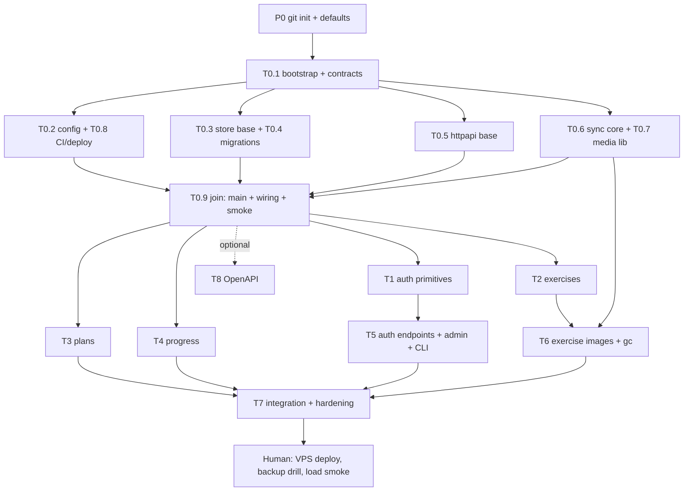

# Task Breakdown

Status: **Wave 0 done (T0.1–T0.9 merged on `main`); Wave 1 next.** Derived from the [implementation plan](implementation-plan.md), [data model](data-model.md) and the 21 endpoint specs. Purpose: split the work so several subagents can run in parallel without stepping on each other.

Legend: **∥** = subtasks inside a task can run in parallel. **Owns** = only files this task may write. **Gate** = what must be merged before it starts. Milestone column maps to [§10 of the plan](implementation-plan.md#10-build-order-and-milestones).

## 0. Prerequisites (before spawning any agent)

| # | What | Why |
|---|------|-----|
| P0.1 | `git init`, `.gitignore`, commit the docs | Directory is **not a git repo**. Parallel agents in one directory break each other's builds (half-written files in a shared Go package). With git, each agent gets its own worktree/branch and the orchestrator merges. |
| P0.2 | Confirm defaults: `goose` for migrations, systemd for the unit file, Go version (local is 1.24.5; T0.1 checks go.dev for latest stable) | Plan §13 says decide at M0. |
| P0.3 | Test database = Docker Postgres (latest stable major), not local brew (v14) | Plan says latest stable major; tests need a real Postgres. |

If P0.1 is declined: fall back to **one agent per Go package set at a time** (no two agents in the same package), which serialises most of Wave 1. Not recommended.

## 1. Parallelism at a glance

Key facts that make wide parallelism possible:

- **All 5 migrations are derivable from `data-model.md` alone**, so they land in Wave 0. After that, exercises, plans, progress and auth have no schema dependency on each other.
- **`expand=exercises` on plans/progress is not a join to the exercise master.** It returns full child rows of the plan/session itself (see specs 05/06/07). Plans and progress do not depend on the exercises code, only on the `exercises` table existing (FK check by plain SQL).
- **Test seed helpers** (`SeedUser`, `SeedToken`, `SeedExercise`, raw SQL) and a `WithPrincipal(ctx, ...)` test helper let resource tracks test without the real login flow.
- **Pure libraries** (conflict rule, cursor codec, media storage, hashing, limiter) have no DB or HTTP deps and start immediately.

| Wave | Starts when | Agents in parallel | Tasks |
|------|-------------|--------------------|-------|
| 0a | P0 done | 1 | T0.1 |
| 0b | T0.1 merged | 4 | [T0.2 + T0.8], [T0.3 + T0.4], [T0.5], [T0.6 + T0.7] |
| 0c | Wave 0b merged | 1 | T0.9 |
| 1 | T0.9 merged | 4 (+1 optional) | T1, T2, T3, T4 (+ T8) |
| 2 | rolling: T5 when T1 merged; T6 when T2 merged | 2 | T5, T6 |
| 3 | T3, T4, T5, T6 merged | 3, then 1 | T7.1–T7.4 in parallel, then T7.5–T7.6 |

Cap at ~4–5 concurrent agents (2-core dev box, Docker Postgres shared). Critical path: T0.1 → T0.3/T0.4 → T0.9 → T1 → T5 → T7.

## 2. Wave 0: foundation (milestone 0)

### T0.1 Bootstrap and contracts (serial, blocks everything)

- T0.1.1 `go mod init`; pin `go` + `toolchain`; add **all** dependencies up front (`pgx/v5`, `goose/v3`, `x/crypto`, `google/uuid`) so no later task edits `go.mod`.
- T0.1.2 Directory tree from plan §2, `.gitignore`, Makefile skeleton (`build`, `test`, `lint`, `migrate`, `run`, `db-up`).
- T0.1.3 `internal/domain`: enums and limits from [enums.md](api/enums.md) (single source), role type, `Principal{UserID, Role}`, typed errors (`NotFound`, `Conflict{Issue, Details}`, `Validation`, `Forbidden`, `Unauthorized`, `RateLimited`).
- T0.1.4 `internal/clock`: interface, real clock, fake clock.
- Done when: `go build ./...` and `go vet ./...` pass; domain has unit tests for enum lookups.

### T0.2 Config (∥ with T0.3–T0.8)

- Env parsing for every variable in plan §3, defaults, `APP_ENV` relaxed dev mode, one error listing **all** invalid/missing vars, unit tests.
- Owns: `internal/config/**`.

### T0.3 Store base and test harness (same agent as T0.4)

- T0.3.1 `pgxpool` setup (`DB_MAX_CONNS`), `WithTx` helper, DB ping.
- T0.3.2 goose runner with embedded `migrations/`, `migrate up` function.
- T0.3.3 `internal/testutil`: `docker compose` file for Postgres, per-package test DB from `TEST_DATABASE_URL`, truncate helper, raw-SQL seeds `SeedUser(role)`, `SeedToken`, `SeedExercise`, `SeedPlan`.
- Owns: `internal/store/db.go`, `internal/testutil/**`, `docker-compose.test.yml`.

### T0.4 Migrations (same agent as T0.3)

- T0.4.1 `0001` extension `pg_trgm` + `users`; `0002` `auth_tokens`; `0003` `exercises` + indexes (partial unique `lower(name)`, trigram GIN, all-or-none image columns); `0004` `workout_plans` + `workout_plan_exercises`; `0005` `progress`, `progress_exercises`, `progress_sets`.
- T0.4.2 CHECK constraints generated from or verified against `domain` enums (parity test).
- T0.4.3 Tests: apply to an empty DB; constraint tests (image columns, unique name after soft delete, position uniqueness, cascade).
- Owns: `migrations/**`.

### T0.5 HTTP base

- T0.5.1 Router with **all 21 routes + `/healthz` registered as 501 stubs**, one stub handler file per resource (`auth`, `admin`, `exercises`, `plans`, `progress`) so later tasks only replace their own file.
- T0.5.2 Role middleware driven by a route table that mirrors the [access matrix](api/conventions.md#roles--access); `Principal` in request context plus `WithPrincipal` test helper; an `Authenticator` slot the auth middleware plugs into later.
- T0.5.3 Error mapper: domain errors → JSON error format + status; unknown → 500 `internal`, no leak.
- T0.5.4 Helpers: strict JSON decode (unknown field → 400), JSON write, pagination parser (`limit` default 50 / max 200, opaque `cursor`), path UUID parser.
- T0.5.5 Middleware: recover, request id, access log (never bodies or `Authorization`), body limit (1 MiB, 2 MiB on image route).
- Owns: `internal/httpapi/**` (router, middleware except `auth.go`/`ratelimit.go`, stub handlers).

### T0.6 Sync core (pure, same agent as T0.7)

- T0.6.1 Conflict decision function: `Decide(existing, incomingUpdatedAt, now)` → insert / deleted-409 / stale-409 / no-op / update, plus the 5-minute-future rejection.
- T0.6.2 Cursor codec: `(server_updated_at µs, id)` → opaque base64url; strict decode; microsecond truncation helper.
- T0.6.3 Table-driven tests (missing / deleted / older / equal / newer).
- Owns: `internal/domain/sync*.go`.

### T0.7 Media library (pure, same agent as T0.6)

- T0.7.1 Sniff type from bytes (JPEG/PNG/WebP), `image.DecodeConfig` for dimensions (≤ 2000 px), size cap 2 MiB, 16-hex content hash.
- T0.7.2 Disk store: temp file → fsync → rename → fsync dir into `exercises/{id}/{hash}.{ext}`; delete; sweep with a caller-supplied "referenced" set (used by `media gc`).
- T0.7.3 Tests: corrupt image, wrong type, oversize, fault injection between steps (no partial final file).
- Owns: `internal/media/**`.

### T0.8 CI and deploy files (same agent as T0.2)

- CI workflow (vet, lint, `go test -race` with a Postgres service), `.golangci.yml`, `deploy/Caddyfile` (`/media/*` static + cache/nosniff headers, proxy with `X-Forwarded-For`), systemd unit (migrate then serve), `deploy/env.example`, `deploy/backup.sh` (pg_dump + `MEDIA_DIR` off-box, 14-day retention), Postgres tuning snippet, swap and firewall notes.
- Owns: `.github/**`, `.golangci.yml`, `deploy/**`.

### T0.9 Join (serial)

- `cmd/server/main.go` subcommand dispatcher (`serve`, `migrate up`; `admin` and `media gc` stubbed), slog JSON logger, graceful shutdown, `Deps{DB, Clock, Config, Logger}` and `wire.go` with **fixed-signature stub constructors** for every service and handler (later tasks fill bodies, never change signatures), `/healthz` with DB ping.
- Verify: `make test lint` green, `migrate up` on an empty DB, server boots, `/healthz` 200, every other route 501, role middleware returns 403 for a wrong-role principal.
- Done when: milestone 0 checklist except the VPS deploy (human step).

## 3. Wave 1: vertical slices (all parallel after T0.9)

### T1 Auth primitives (M1, part 1)

- T1.1 ∥ argon2id hasher: params from config, encoded string, semaphore (`ARGON2_MAX_CONCURRENT`) with bounded wait then 429, dummy-hash verification for unknown usernames.
- T1.2 ∥ Token generator: `wt_` + 32 random bytes (`crypto/rand`), base64url; SHA-256 hashing helper.
- T1.3 ∥ Login limiter: in-memory, per username and per IP, sliding 15 min, `LOGIN_MAX_FAILS_*`, lock minutes, periodic cleanup, fake-clock tests.
- T1.4 ∥ Store `users.go`, `auth_tokens.go`: get user by username/id, insert user, update password, insert token, lookup by hash (joined with role), touch `last_used_at` (≤ hourly), list by user, revoke one, revoke all-except-current, revoke all for a user, purge expired/revoked > 30 days.
- T1.5 (after T1.2 + T1.4) Auth middleware: bearer parse → SHA-256 → lookup → expiry/revoked check → `Principal`; 401 with `WWW-Authenticate: Bearer`; trusted-proxy client IP; generic per-IP rate-limit middleware for auth/admin routes.
- Owns: `internal/auth/**`, `internal/store/users.go`, `internal/store/auth_tokens.go`, `internal/httpapi/middleware/auth.go`, `internal/httpapi/middleware/ratelimit.go`.

### T2 Exercises (M3)

- T2.1 ∥ Domain + validation: name trimmed 1–100, all enums, secondary muscles (≤ 5, no duplicates, not primary), instructions ≤ 4000, optional client-supplied id.
- T2.2 ∥ Store: create (unique violation → `Conflict{already_exists, existing_id}`), get, list (`q` trigram search, filters, `updated_since` + `include_deleted`, order `(updated_at, id)`, cursor), update, soft delete, image-fields update method (for T6).
- T2.3 (after T2.1 + T2.2) Service + handlers for endpoints 9, 8, 18, 19, plus the exercise response mapper including `image_url` built from `MEDIA_BASE_URL` + id + hash + ext (T6 reuses it).
- T2.4 Tests per spec: every error code, filters/search, sync feed includes deleted rows, name reusable after delete, pagination stability. Uses `WithPrincipal` + seeds, no dependency on T1.
- Owns: `internal/domain/exercise.go`, `internal/store/exercises.go`, `internal/service/exercises.go`, `internal/httpapi/handlers/exercises.go`.

### T3 Workout plans (M5)

- T3.1 ∥ Domain + validation: name 1–100, description ≤ 1000, ≤ 50 exercises, target rules (`target_reps_max` needs `target_reps` and ≥ it, ranges), unique positions, `updated_at` not > 5 min ahead.
- T3.2 ∥ Store: upsert transaction (ownership check → 404, `FOR UPDATE`, `Decide`, delete + insert children, set `server_updated_at`, retry once on unique violation), 100 active plans cap (`plan_limit`, inserts only), unknown `exercise_id` → 422 via plain SQL, get, list (summary with `exercise_count`; `expand=exercises` full objects; default order `lower(name), id`; `updated_since` order `(server_updated_at, id)`), soft delete.
- T3.3 (after T3.1 + T3.2) Service + handlers for endpoints 10, 7, 6, 17.
- T3.4 Tests: conflict table at HTTP level, ownership 404, cap, `expand`, concurrent PUT of the same id under `-race`.
- Owns: `internal/domain/plan.go`, `internal/store/plans.go`, `internal/service/plans.go`, `internal/httpapi/handlers/plans.go`.

### T4 Progress (M6)

Same shape and conventions as T3, three-level children. Do not copy code from T3 while running in parallel; T7.5 dedupes afterwards.

- T4.1 ∥ Domain + validation: `ended_at ≥ started_at`, `duration_seconds` 0–86400, exercise/set limits per [spec 03](api/endpoints/03-save-progress.md), set `type` enum, non-negative metrics, `rpe` 1–10 step 0.5, 5-minute future rule.
- T4.2 ∥ Store: upsert transaction over `progress`, `progress_exercises`, `progress_sets`; optional `workout_plan_id` validation per spec; get with children; list (summaries with `exercise_count`/`set_count`, `expand=exercises`, default order `started_at DESC`, sync order `(server_updated_at, id)`); soft delete.
- T4.3 (after T4.1 + T4.2) Service + handlers for endpoints 3, 4, 5, 16.
- T4.4 Tests: conflict table, ownership 404, deleted-exercise reference accepted, `expand`, concurrent PUT under `-race`.
- Owns: `internal/domain/progress.go`, `internal/store/progress.go`, `internal/service/progress.go`, `internal/httpapi/handlers/progress.go`.

## 4. Wave 2: dependent slices

### T5 Auth endpoints, admin endpoints, CLI (M1 rest + M2) — gate: T1 merged

- T5.1 ∥ Login (2): timing-safe verify, limiter check + record, 429 with lock, `device_name`, response `token`/`token_id`/`expires_at`. Files: `service/auth.go`, `handlers/auth.go`.
- T5.2 ∥ Logout (11), revoke (12), list-tokens (15). Same files as T5.1 (one agent, sequential within the file pair) or split by file.
- T5.3 ∥ Register (1): trim/lowercase/format, reserved-name list, duplicate → 409, admin only. Files: `service/admin.go`, `handlers/admin.go`.
- T5.4 ∥ Admin revoke-login (13), admin change-password (14; revokes all tokens in the same transaction).
- T5.5 ∥ CLI `admin create-user` and `admin reset-password` (password from prompt/stdin, bypasses reserved names, reset revokes tokens). Files: `cmd/server/admin.go`.
- T5.6 ∥ Token purge job (daily goroutine under `serve`).
- T5.7 Auth scenario tests with fake clock: brute-force lock, expiry, revoke by id, revoke others/all, admin revoke, password change revokes tokens.
- Owns: `internal/service/auth.go`, `internal/service/admin.go`, `internal/httpapi/handlers/auth.go`, `internal/httpapi/handlers/admin.go`, `cmd/server/admin.go`, purge job file.

### T6 Exercise images and media gc (M4) — gate: T2 merged (T0.7 already merged)

- T6.1 Endpoint 20: 2 MiB read cap (413), content-type/sniff (415), dimensions, hash, write file, DB transaction updating image columns, delete old file after commit (DB never points at a missing file).
- T6.2 Endpoint 21: clear DB columns, delete file.
- T6.3 `media gc` subcommand: referenced set from DB, `--dry-run`.
- T6.4 Tests per plan §9 (upload/replace/delete, wrong type, oversize, corrupt image, crash-safety) and `image_url` present on exercise responses.
- Owns: `internal/service/exercise_images.go`, `internal/httpapi/handlers/exercise_images.go`, `cmd/server/media.go`.

## 5. Wave 3: integration and hardening (M7) — gate: T3, T4, T5, T6 merged

Test files are disjoint, so T7.1–T7.4 run in parallel as `cmd/server/e2e_*_test.go` (they need `newApp` from `package main`; a package cannot import `main`).

- T7.1 ∥ Full-stack role matrix: anonymous / user / admin × all 21 routes; expired and revoked tokens.
- T7.2 ∥ Ownership: user B never sees user A's plans or progress (404) on every read/write/delete route.
- T7.3 ∥ Sync scenarios with two "phones": offline upload, stale write → 409, retry after lost response → 200 no-op, delete on one phone then pull on the other, exercise deleted then referenced by an offline save.
- T7.4 ∥ Secrets and limits: assert logs and error bodies never contain tokens/passwords, body-size limits (1 MiB / 2 MiB), generic per-IP limits.
- T7.5 (serial, after T7.1–T7.3 green) Dedupe pass: shared upsert/list/cursor code between plans and progress, no behavior change.
- T7.6 (serial) `go vet`, lint, `go test -race ./...` clean; fix findings.

Human steps (not for subagents): provision VPS, deploy behind Caddy, test backup **and restore**, load smoke test, log review, firewall + swap.

## 6. Optional: T8 Handover (M8)

OpenAPI 3.1 built from the endpoint specs plus example requests (`.http` or curl). Depends only on docs, so it can run any time after Wave 0 as a fifth parallel agent; do one reconcile pass against the real behavior after T7.

## 7. File ownership and seams

Each task writes only its **Owns** files. T0.9 created one stub file per resource at every layer, with fixed signatures pinned by `seams_test.go` in `store`, `service` and `handlers` (changing one breaks the build). A task **overwrites its own stub files** and never edits another task's.

| Layer | Stub files (owner overwrites) | Fixed signature |
|-------|-------------------------------|-----------------|
| store | `users.go`, `auth_tokens.go` (T1); `exercises.go` (T2); `plans.go` (T3); `progress.go` (T4) | `NewX(db *DB) *X` |
| service | `auth.go`, `admin.go` (T5); `exercises.go` (T2); `exercise_images.go` (T6); `plans.go` (T3); `progress.go` (T4) | `NewX(d service.Deps) *X` |
| handlers | same names as service | `NewX(svc *service.X, d handlers.Deps) *X`, methods `func (h *X) Name(w, r)` |

Shared files (report or coordinate; do not edit unless listed):

| Seam | Rule |
|------|------|
| `go.mod`, `go.sum`, `internal/deps/deps.go` | All deps already added. Need a new one → report. `deps.go` is removed in T7.5. |
| `internal/httpapi/router.go`, `routes.go` | All 21 routes registered; never edited by resource tasks. |
| `service.Deps`, `cmd/server/wire.go` | Only T1 edits (Authenticator, RateLimit, Hasher, Limiter fields). T6 uses `Deps.Media`, already there. |
| `cmd/server/serve.go` `startBackground` | Only T5 edits (token purge). |
| `cmd/server/admin.go` / `media.go` | T5 / T6 rewrite wholesale. Shared test helpers live in `cmd/server/helpers_test.go`; prefix new ones. |
| `migrations/**` | Whole schema exists. Schema change → orchestrator adds `0006+`. |
| `internal/domain` | Add only your own `domain/<resource>.go`. |

Constraint and index names to match in store code (from T0.4): `<table>_<cols>_uniq|_fkey|_chk|_idx`, e.g. `users_username_uniq`, `exercises_name_lower_uniq`. Name search must use `lower(name) LIKE '%' || lower($1) || '%'` to hit the trigram index.

## 7b. Operating notes (learned in Wave 0)

- **Worktrees:** the orchestrator creates one per agent: `.worktrees/<wave>-<name>` on branch `<wave>/<name>` (git-ignored), agents commit there, orchestrator merges into `main` and removes them. The built-in `isolation: "worktree"` does not work in this session.
- **Go toolchain:** `go.mod` needs Go 1.27; the shell has `GOTOOLCHAIN=local`. Use `export GOTOOLCHAIN=auto` or `make`. `GOPROXY` is unreachable; all modules are cached, so do not add dependencies.
- **rtk hook** may print "Success" for a failed command; check exit codes.
- **Test DB:** `make db-up` (postgres:18 on `127.0.0.1:55432`); `testutil.NewDB(t)` gives each test its own throwaway database, so agents can run tests concurrently.
- **Spec decisions:** conflict extras live in `details[0]` (`current`, `existing_id`); bad `updated_since`/cursor → 400 `bad_request`; empty image body → 400.

## 8. Subagent brief (template)

Every agent prompt contains:

1. Task id and goal, copied from this file, plus the **Owns** list and the seam rule above.
2. Docs to read first: `implementation-plan.md` (sections named per task), `data-model.md` (tables named per task), `api/conventions.md`, and the endpoint specs listed for the task.
3. Testing: integration tests against real Postgres via `TEST_DATABASE_URL`, table-driven unit tests, `-race`; use seeds and `WithPrincipal`, not other tasks' unfinished code.
4. Done = every subtask above implemented, `go vet` and lint clean, tests green.
5. Final report: files changed, deviations from the spec (with reason), open questions. No scope beyond the task.
